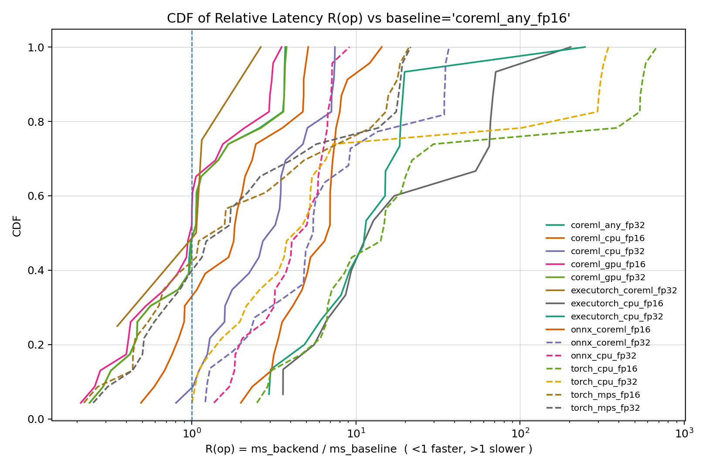

# opdiff – Cross‑Backend PyTorch Operator & Module Testing Framework

## What is opdiff?

**opdiff** is a YAML-driven testing framework for validating correctness, support, 
and performance consistency of PyTorch operators and modules across concrete 
execution backends implemented in the framework, including Torch (CPU / CUDA / MPS), 
ONNX Runtime, CoreML, and ExecuTorch.

Tests are defined declaratively using a structured YAML specification, enabling 
large-scale operator sweeps, templated module expansions, and systematic backend 
coverage with minimal boilerplate.

Any backend can be selected as the baseline for comparison. The framework runs a 
chosen baseline backend and compares other target backends against it for numerical 
parity and performance metrics.

The framework is designed for:
- Systematic operator coverage
- Backend support analysis
- Numerical parity validation
- Latency benchmarking
- Export pipeline debugging

---
## Setup

1.  Clone the repository and create a virtual environment.

2.  Install dependencies:

    ``` bash
    pip install -r requirements.txt
    ```

    This installs **torch 2.10.0** and **executorch 1.1.0** by default.\
    Note that the ExecuTorch MPS target may fail entirely, likely due to
    the new experimental Metal backend. For now, it is recommended to
    skip the ExecuTorch MPS target for now.

3.  If you prefer to use **torch 2.7.0**, install:

    ``` bash
    pip install executorch==0.6.0 torch==2.7.0
    ```
    **executorch 0.6.0** appears to have more stable support for the MPS target.

---
## Test Cases (YAML)

opdiff tests are defined declaratively in YAML so you can scale from a few hand-written
cases to large operator sweeps using shared presets, symbolic dims, and templates.

### Where to find the full spec and examples

#### See [testgen/testcase_spec.md](testgen/testcase_spec.md) for detailed specs

#### See [examples/demo.yaml](examples/demo.yaml) for example testcases with comments

### Minimal example

```yaml
dims:
  B: 2
  N: 4

presets:
  x_bn:   {type: tensor, shape: [B, N], kind: float, init: normal}
  y_bn:   {type: tensor, shape: [B, N], kind: float, init: uniform, low: -1, high: 1}

tests:
  - id: add
    op: aten::add
    in:
      - {ref: x_bn}
      - {ref: y_bn}

  - id: mod_linear
    op:
      type: module
      path: torch.nn.Linear
      args: [4, 3]
      kwargs: {bias: true}
    in:
      - {ref: x_bn}

  - id: mod_linear_template
    op:
      type: template_module
      path: torch.nn.Linear
      vars:
        in_features: [N]
        out_features: [3, 5, 7]
        bias: [true, false]
      args: [{var: in_features}, {var: out_features}]
      kwargs: {bias: {var: bias}}
    in:
      - {ref: x_bn}

  - id: toy_ln_load_from_path
    op:
      type: module
      path: file:examples/toy_wrappers.py::ToyLogitsLN
      args:
        - type: construct
          path: file:examples/toy_model.py::ToyConfig
          args: []
          kwargs: {in_dim: 4, hidden_dim: 32, out_dim: 7, seed: 0}
      kwargs: {}
    in: [{ref: x_bn}] # same as - {ref: x_bn}
```
You can also use an orchestrator YAML to aggregate multiple test-suite files into a single run. 
Create a top-level file that lists other YAMLs under include: 

```yaml
include:
  - test1.yaml 
  - test2.yaml
  ...
  - testN.yaml
```
---

## Running Tests (Interface: `run`)

The unified entry point is `pipeline.api.run(...)`. It runs a YAML test suite across one or more backend presets and writes JSONL results.

### Parameters (brief)

- `yaml_path` (str): Path to the YAML test suite.
- `target_backends` (list[str]): Backend preset names to run for each test item. Check `pipeline/presets.py` for presets
- `test_ids` (list[str] | None): Optional test id filters; supports prefix match like `"aten.add*"`.
- `skipped_tests` (list[dict] | None): Optional skip list entries like `{"id": "<test_id>", "backend": "<backend_or_*>"}`.
- `baseline_backend` (str | None): Optional baseline preset for single tests; any backend can be used as baseline. If not set, only collect timings without doing output diff.
- `adhoc_pairs` (list[dict] | None): Optional explicit left-vs-right comparisons.
- `repeats` (int): Number of inference repeats per backend execution.
- `num_sampled_inputs` (int): Number of independently sampled input sets; repeats cycle through them.
- `seed` (int): Base RNG seed for deterministic input generation.
- `allow_all_zero_output` (bool): If `False`, fails if first output is all zeros.
- `backend_overrides` (dict | None): Optional per-backend override dict passed into backend creation.
- `mode` (int): `1` = single output diff; `2` = per-repeat timings + per-repeat output diffs.
- `output_path` (str): JSONL output file path.
- `output_mode` (str): `"w"` overwrite or `"a"` append a new run section.
- `timeout_s` (float | None): If set, enforces per-(test, backend) hard timeout via subprocess isolation (slower). If not, run tests in-process.
-  `do_clean` (bool): If `False`, do not clean system temporary files and cache after run.


### Default Values

Unless explicitly overridden, `pipeline.api.run(...)` uses the following defaults:

- `test_ids = None`  
  → Run **all expanded tests** in the YAML suite.

- `skipped_tests = None`  
  → Do not skip any (test, backend) combinations.

- `baseline_backend = None`  
  → Do **not** compute output diffs; only collect backend timing and status.

- `adhoc_pairs = None`  
  → Only use test items defined in the YAML suite.

- `repeats = 1`  
  → Run each backend exactly once per test item.

- `num_sampled_inputs = 1`  
  → Use a single sampled input set (repeats cycle if `repeats > 1`).

- `seed = 0`  
  → Deterministic input generation starting from seed 0  
    (for pair tests, right side uses `seed + 1`).

- `allow_all_zero_output = True`  
  → Do not fail if the first observed output is entirely zero.

- `backend_overrides = None`  
  → Use preset defaults exactly as defined in `pipeline/presets.py`.

- `mode = 1`  
  → Compute a single diff per comparison (no per-repeat timing/output recording).

- `output_mode = "w"`  
  → Overwrite the output JSONL file.

- `timeout_s = None`  
  → Run everything in-process (no subprocess isolation).

- `do_clean = True`  
  → Clean system temporary files and cache after run. See [Automatic Temporary File/Cache Cleanup](#automatic-temporary-filecache-cleanup).

These defaults are designed for fast, deterministic local testing. For benchmarking or robustness testing, you typically increase `repeats`, `num_sampled_inputs`, enable `mode=2`, and optionally set `timeout_s`.

### Example

```python
from pipeline.api import run

if __name__ == "__main__":
    # mode2 needs to run under __main__.
    run(
        yaml_path="examples/demo.yaml",
        baseline_backend="torch_cpu_fp32",
        target_backends=[
            "onnx_cpu_fp32",
            "coreml_cpu_fp32",
            "coreml_any_fp16",
        ],
        backend_overrides={
            "coreml_cpu_fp32": {"torch_export_overrides": {"use_default_decompositions": False}},
            "coreml_any_fp16": {"torch_export_overrides": {"use_default_decompositions": False}},
        },
        repeats=10,
        num_sampled_inputs=1,
        seed=0,
        mode=2,
        output_path="results.jsonl",
        output_mode="w",
        timeout_s=30,
    )
```
Or ad-hoc pairs (work in progress). *For all pair tests, `baseline_backend` is ignored. The comparison is performed between the left and right cases under the same backend.*

```python
run(
    yaml_path="examples/demo.yaml",
    target_backends=["torch_cpu_fp32", "onnx_cpu_fp32"],
    adhoc_pairs=[
        {
            "id": "add_ref_vs_add_alpha",
            "left_yaml": "examples/demo.yaml",
            "left_id": "op_add_ref_ref",
            "right_yaml": "examples/demo.yaml",
            "right_id": "op_add_with_alpha_kw",
        }
    ],
    repeats=10,
    num_sampled_inputs=3,
    seed=0,
    output_path="runs/adhoc_pair.jsonl",
    output_mode="w",
)
```

---

## `cli.py`

`cli.py` is a thin command-line wrapper around `pipeline.api.run(...)` that lets you run YAML test suites across one or more backend presets and write results to JSONL. It also includes helpers to list available presets, list expanded test ids, and validate a suite loads/expands without running any backends.

### Commands

- `list-presets`  
  Print all available backend preset names (one per line).

- `list-tests <yaml>`  
  Load a YAML suite, expand all tests (including templates/pairs), and print the resulting test ids.

- `validate-yaml <yaml>`  
  Load and expand a YAML suite and exit (no execution). Useful for catching YAML/config errors early.

- `run <yaml>`  
  Execute tests on selected backends, optionally compare to a baseline backend, and write a JSONL run file.

### Notes on quoting

`--backends`, `--test-ids`, and `--skips` use `;` to separate multiple values. In `zsh`/`bash`, `;` is a command separator and `*` is a glob, so **quote these arguments** when they contain `;` or `*`.

### Running all tests vs selected tests

- If `--test-ids` is **omitted**, `run` executes **all expanded tests** in the YAML suite.
- If `--test-ids` is provided, it selects only those tests whose ids match any listed pattern (exact match, or prefix match when the pattern ends with `*`).

### Examples (repo_root/examples/demo.yaml)

```bash
# 0) Show available backend preset names (one per line)
python cli.py list-presets

# 1) Validate a YAML suite (loads + expands tests; fails if YAML invalid or selected ids missing)
python cli.py validate-yaml examples/demo.yaml

# 2) List expanded test ids (after template expansion / cases / pair expansion)
python cli.py list-tests examples/demo.yaml

# 2b) List only ids matching patterns (useful to discover exact expanded ids)
python cli.py list-tests examples/demo.yaml --test-ids 'mod_linear_*;toy_ln_*;fft_*'

# 3) Run ALL tests on a single backend (writes JSONL)
python cli.py run examples/demo.yaml   --backends torch_cpu_fp32   --out runs/demo_out.jsonl

# 4) Run a small subset on a single backend (no baseline diff; writes JSONL)
python cli.py run examples/demo.yaml   --backends torch_cpu_fp32   --test-ids 'op_add_ref_ref;op_add_with_alpha_kw;op_mul_scalar_tensor'   --out runs/demo_out.jsonl

# 5) Run multiple backends and compare each vs the baseline backend (single-item tests only)
python cli.py run examples/demo.yaml   --backends 'torch_cpu_fp32;onnx_cpu_fp32'   --baseline torch_cpu_fp32   --test-ids 'op_add_ref_ref;op_where_bool_cond;op_cat_tensor_list'   --out runs/demo_out.jsonl

# 6) Run module tests (torch.nn.* module specs) on multiple backends
python cli.py run examples/demo.yaml   --backends 'torch_cpu_fp32;torch_cpu_fp16'   --test-ids 'mod_linear_forward;mod_layernorm_impl_cpu;mod_sequential_with_construct'   --out runs/demo_out.jsonl

# 7) Run templated tests (template_module expands into multiple concrete tests)
# - templated tests must use prefix matching
python cli.py run examples/demo.yaml   --backends torch_cpu_fp32   --test-ids 'mod_linear_template*'   --out runs/demo_out.jsonl

# 8) Run templated tests with cases constraints (template_module + cases restrict cartesian product)
python cli.py run examples/demo.yaml   --backends torch_cpu_fp32   --test-ids 'mod_linear_cases_match_input_features*'   --out runs/demo_out.jsonl

# 9) Run a pair test (template_compare_pair): compares A vs B within the SAME backends
python cli.py run examples/demo.yaml   --backends 'torch_cpu_fp32;onnx_cpu_fp32'   --test-ids toy_ln_vs_rms_pair   --out runs/demo_out.jsonl

# 10) Skip specific (id, backend) combinations
# - format: id:backend;id:backend;...  (backend can be "*")
python cli.py run examples/demo.yaml   --backends 'torch_cpu_fp32;onnx_cpu_fp32'   --test-ids 'op_add_ref_ref;op_gather_dim1;op_permute_int_list'   --skips 'op_gather_dim1:onnx_cpu_fp32'   --out runs/demo_out.jsonl

# 11) Append to an existing JSONL (writes a new run header + item records)
python cli.py run examples/demo.yaml   --backends torch_cpu_fp32   --test-ids op_add_ref_ref   --out runs/demo_out.jsonl

python cli.py run examples/demo.yaml   --backends torch_cpu_fp32   --test-ids op_add_with_alpha_kw   --append   --out runs/demo_out.jsonl

# 12) Mode 2: record per-repeat timings/outputs and per-repeat diffs (more detailed JSONL)
python cli.py run examples/demo.yaml   --backends onnx_cpu_fp32   --baseline torch_cpu_fp32   --test-ids 'op_add_ref_ref;mod_sequential_with_construct'   --mode 2   --repeats 10   --num-sampled-inputs 3   --out runs/demo_out.jsonl

# 13) Timed isolation: setting --timeout-s automatically selects the timed subprocess runner
python cli.py run examples/demo.yaml   --backends onnx_cpu_fp32   --baseline torch_cpu_fp32   --test-ids 'op_add_ref_ref;mod_sequential_with_construct'   --mode 2   --repeats 10   --num-sampled-inputs 3   --timeout-s 10   --out runs/demo_out.jsonl

# 14) Enforce non-zero outputs (fail fast if first output is all zeros)
python cli.py run examples/demo.yaml   --backends torch_cpu_fp32   --test-ids op_add_ref_ref   --no-allow-all-zero-output   --out runs/demo_out.jsonl

# 15) Backend overrides via file (recommended for anything non-trivial)
python cli.py run examples/demo.yaml   --backends 'onnx_cpu_fp32;torch_cpu_fp16'   --baseline torch_cpu_fp32   --test-ids 'op_add_ref_ref;op_cat_tensor_list'   --backend-overrides-file examples/backend_overrides.json   --out runs/demo_out.jsonl

# 15b) Overrides via inline JSON
python cli.py run examples/demo.yaml   --backends 'onnx_cpu_fp32;torch_cpu_fp32'   --baseline torch_cpu_fp32   --test-ids 'op_add_ref_ref;op_cat_tensor_list'   --backend-overrides-json '{"onnx_cpu_fp32":{"onnx_overrides":{"opset":19}}}'   --out runs/demo_out.jsonl

# 16) No cache clean after run
python cli.py run examples/demo.yaml   --backends torch_cpu_fp32  --no-clean-tmp  --out runs/demo_out.jsonl

```

### Key flags

- `--backends 'A;B;C'`: backend presets to run.
- `--test-ids 'PAT1;PAT2;...'` (optional): select tests by exact id or prefix pattern with trailing `*`. If omitted, run all tests.
- `--baseline NAME`: baseline preset used for diffs on single-item tests.
- `--skips 'id:backend;id:backend'`: skip specific (id, backend) runs; use backend `*` to skip all backends for an id.
- `--out PATH`: output JSONL path.
- `--append`: append a new run to an existing JSONL file instead of overwriting.
- `--timeout-s SECONDS`: per-(item, backend) hard timeout (enables subprocess isolation automatically).
- `--mode 1|2`: mode 2 records per-repeat timings/outputs and per-repeat diffs.
- `--backend-overrides-file PATH` / `--backend-overrides-json STRING`: per-backend option overrides.

### Cli ad-hoc pairs

Not supported. Work in progress.

---

## Output Format (JSONL)

Each run writes a **JSONL (JSON Lines)** file.

-   One JSON object per line\
-   First line: **meta record** (run configuration)\
-   Subsequent lines: **one item record per test**

### 1. Meta Record (first line)

``` json
{
  "type": "meta",
  "meta": {
    "format_name": "...",
    "format_version": ...,
    "created_at": "...",
    "env": { "...": "..." },
    "extra": {
      "yaml": "...",
      "params": {
        "seed": ...,
        "repeats": ...,
        "num_sampled_inputs": ...,
        "mode": ...
      }
    }
  }
}
```

### 2. Item Record (Single Test)

#### Mode 1 (summary diff only)

``` json
{
  "type": "item",
  "id": "...",
  "test_type": "single",
  "cases": [ { "...": "..." } ],

  "baseline": {
    "backend": "...",
    "status": "...",
    "ms": ...,
    "times_all": null
  },

  "backends": [
    {
      "backend": "...",
      "res": [
        { "status": "...", "ms": ... }
      ],
      "times_all": null,
      "diff_all": [
        { "ok": true, "mse": ..., "max_abs": ..., "mean_abs": ... }
      ]
    }
  ]
}
```

#### Mode 2 (per-repeat timings and diffs)

``` json
{
  "type": "item",
  "id": "...",
  "test_type": "single",

  "backends": [
    {
      "backend": "...",
      "res": [
        { "status": "OK", "ms": ... }
      ],
      "times_all": [
        [1, 2, 3, ...]
      ],
      "diff_all": [
        { "ok": true, "mse": ..., "max_abs": ..., "mean_abs": ... },
        { "ok": true, "mse": ..., "max_abs": ..., "mean_abs": ... },
        { "ok": true, "mse": ..., "max_abs": ..., "mean_abs": ... }
      ]
    }
  ]
}
```

### 3. Pair Test (A vs B under same backend)

``` json
{
  "type": "item",
  "id": "...",
  "test_type": "pair",
  "cases": [
    { "side": "A", "...": "..." },
    { "side": "B", "...": "..." }
  ],

  "backends": [
    {
      "backend": "...",
      "res": [
        { "status": "...", "ms": ... },  // A
        { "status": "...", "ms": ... }   // B
      ],
      "times_all": [
        [1, 2, 3, ...],   // A per-repeat times
        [1, 2, 3, ...]    // B per-repeat times
      ],
      "diff_all": [
        { "ok": true, "mse": ..., "max_abs": ..., "mean_abs": ... },
        { "ok": true, "mse": ..., "max_abs": ..., "mean_abs": ... },
        { "ok": true, "mse": ..., "max_abs": ..., "mean_abs": ... }
      ]
    }
  ]
}
```

### Field Notes

-   `ms` → median latency for that side/backend\
-   `times_all` → per-repeat timing lists (present in `mode=2`)\
-   `diff_all`
    -   `single`: backend vs baseline\
    -   `pair`: A vs B\
-   `res` always contains one entry per side

---
## Analysis

Three analysis scripts `report_*` are provided in `measure/`. These scripts are still a work in progress and may change. 

They can produce figures like:



---
## Notes

### Automatic Temporary File/Cache Cleanup
By default, after each run(...) execution, the framework calls clean_sys_tmp() to remove temporary artifacts generated during backend export and execution.

This includes files such as:
- opdiff-*
- onnxruntime-*
- *.onnx
- *.mlpackage
- *.mlmodelc
- *.pte
- tmp*
- ExecuTorch/CoreML cache directories under ~/Library/Caches

These artifacts are commonly produced by ONNX, CoreML, and ExecuTorch exports. Cleaning them prevents disk space accumulation over repeated runs.

### Platform Notes (macOS vs Windows)
The framework is primarily developed and tested on macOS. Most backend combinations — especially CoreML and ExecuTorch — are validated on macOS.

### macOS
- CoreML backends are fully supported.
- ExecuTorch (including CoreML targets) is supported.
- All related presets are registered and available.

### Windows
- CoreML/ExecuTorch-related presets are not registered.
- CoreML/ExecuTorch backends are not available.

---
## High‑Level Use Cases

### 1. Backend Support Analysis

Determine which ATen operators are supported under different backends,
opsets, precision modes, and device targets.

Example questions:

- Does opset version affect ONNX support rate?
- Which ops fail under CoreML FP16?
- Are there inconsistencies between CPU and GPU providers?

### 2. Numerical Parity Validation

Compare backend outputs against PyTorch using structured diff metrics:

- Mean squared error (MSE)
- Max absolute difference
- Mean absolute difference
- Structural compatibility checks
- Explicit NaN detection

Useful for:

- Export correctness validation
- Decomposition debugging
- Verifying backend lowering changes

### 3. Latency Benchmarking

Measure runtime across backends.

Features:

- Median timing per operator
- Per‑run timing storage
- Ratio analysis against a baseline backend
- CDF plots of relative speed
- Faster/slower percentage breakdowns

Useful for:

- Backend performance comparisons
- FP16 vs FP32 studies
- Hardware target evaluation


### 4. Export Pipeline Debugging

The framework isolates failures into structured categories:

- EXPORT_FAIL
- INFER_FAIL
- TIMED_ERROR
- ...

Each (test, backend) execution can be sandboxed in a subprocess with
timeout protection to prevent a single failure from halting the entire run.

---
## Call for Contributions

We welcome and encourage you to submit new YAML test cases of any kind. Expanding ATen operator coverage, adding module/model variants, or increasing shape diversity all strengthen the framework. If you encounter mismatches, export failures, numerical instability, or performance surprises, turn them into reproducible tests and share them. Code contributions are equally welcome, whether it's new backends, presets, metrics, analysis tooling, or infrastructure improvements. More coverage and more ideas make cross-backend validation stronger for everyone!

---

## License

MIT License.

